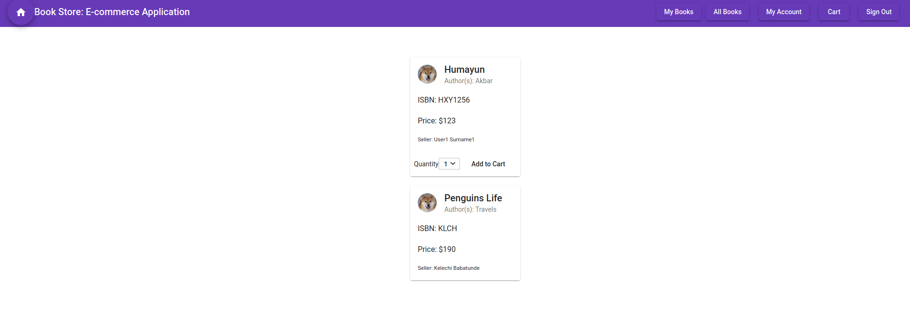

# Assignment 3 - webapp - Bookstore 
Assignment 3 for the course CSYE 6225 Network Structures and Cloud Computing 

## Technologies/Frameworks Used

Frontend: Angular 8

Backend: Express, Nodejs  

Database: MySQL 

Authentication/Authorization: JWT, bcrypt

## Running the project: 
* Pre-requisites: 
1. Ensure MySQL server is installed and running

* Steps
1. Clone or download the repository
2. In the root folder run npm install to install all the node and express dependecies like JSONWebToken, bcrypt, CORS etc. 
3. Change directory to ui and run the command npm install to install the angular dependencies 
5. Use command "node server.js" OR "npm start" at the root level to start the node server 
6. Use command "ng serve" in "ui" folder to start the front-end
7. App is hosted at http://localhost:4200

## Screenshot

## User Stories:
1. User can sign up by providing the Email, Firstname, Lastname, Password
2. Login using the email and the password 
3. User can set a new password by providing the old password 
4. Change the firstname and the lastname 
5. User can be a buyer or a seller
6. User can add a book. And then manage (delete,update) that book. 
7. Add a book to the cart

## API Endpoints:
Users 
1. GET /users/:email 
2. POST /users/signin
3. POST /users/signup
4. PUT /users/settings/password
5. PUT /users/settings/info
6. GET /test

Books
1. GET /books
2. POST /books
3. PUT /books
4. DELETE /books/:id
5. GET /books/:id 

Cart
1. GET /cart/:id
2. POST /cart/:id
3. PUT /cart/:id
4. DELETE /cart/:id

